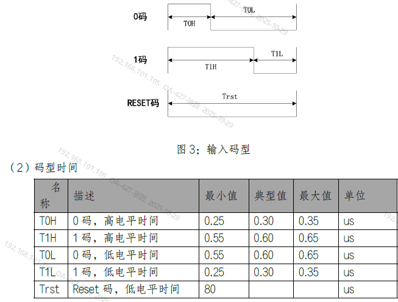

# 汇编

> VM2158幻彩灯数据发送，发送时序如下，使用C语言发送时低电平时间较长，超1us，显示正常，但是不太满足时序要求，使用汇编进行优化，发送1时625/295ns，发送0时330/585ns，时间稳定，使用deepseek生成。使用汇编函数前面加__asm。



```c
// 源代码
#define SET_HIGH() {GPIOA->BSRR = GPIO_BSRR_BS1_Msk; \
                    __NOP(); __NOP(); __NOP(); __NOP(); __NOP(); \
                    __NOP(); __NOP(); __NOP(); __NOP(); __NOP(); \
                    GPIOA->BRR = GPIO_BSRR_BS1_Msk; \
                    __NOP(); \
                    }
#define SET_LOW()  {GPIOA->BSRR = GPIO_BSRR_BS1_Msk; \
                    __NOP(); \
                    GPIOA->BRR = GPIO_BSRR_BS1_Msk; \
                    __NOP(); __NOP(); __NOP(); __NOP(); __NOP(); \
                    __NOP(); __NOP(); __NOP(); __NOP(); \
                    }

for (j = 0; j < 3; j++)
{
    value = rgb_drv_color[j].color;
    for (i = 0; i < 24; i++)
    {
        if (value & 0x800000) {
            SET_HIGH();
        } else {
            SET_LOW();
        }
        value <<= 1;
    }
}
```

```armasm
; 函数：void PollBitsWithRegOps(uint32_t value, uint32_t pin)
; 输入：r0 = 32位数值 (只使用高24位)
;       r1 = pin值 (0-31，决定移位位数)
; 功能：根据pin值移位，从高位到低位轮询前24个bit

__asm void PollBitsWithRegOps(uint32_t value, uint32_t pin)
{
    push {r4, r5, lr}       ; 多保存r5，因为需要更多寄存器
    ldr r2, =0x50000018     ; 第一个寄存器地址
    ldr r3, =0x50000028     ; 第二个寄存器地址
    
    ; 根据pin参数计算移位值
    movs r4, #0x01          ; 加载0x01
    lsls r4, r4, r1         ; 根据pin值左移相应位数
    
    movs r5, #24            ; 循环计数器
    lsls r0, r0, #8         ; 将输入值左移8位，使高24位对齐到bit31-bit8
    
bit_loop
    ; 测试当前bit值
    lsls r0, r0, #1         ; 将输入值左移1位，最高位进入C标志位
    bcc bit_zero            ; 如果C=0（当前bit为0），跳转到bit_zero处理
    
bit_one
    ; bit=1的情况：先写0x50000018，6个NOP，再写0x50000028，1个NOP
    str r4, [r2]            ; 向地址0x50000018写入移位后的值
    nop
    nop
    nop
    nop
    nop
    nop
    str r4, [r3]            ; 向地址0x50000028写入移位后的值
    nop
    b next_bit              ; 跳转到下一个bit处理
    
bit_zero
    ; bit=0的情况：先写0x50000018，1个NOP，再写0x50000028，6个NOP
    str r4, [r2]            ; 向地址0x50000018写入移位后的值
    nop
    str r4, [r3]            ; 向地址0x50000028写入移位后的值
    nop
    nop
    nop
    nop
    nop
    nop
    
next_bit
    ; 循环控制
    subs r5, r5, #1         ; 循环计数器减1
    bne bit_loop            ; 如果计数器不为0，继续循环处理下一个bit
    
    pop {r4, r5, pc}        ; 恢复寄存器并返回
}
```